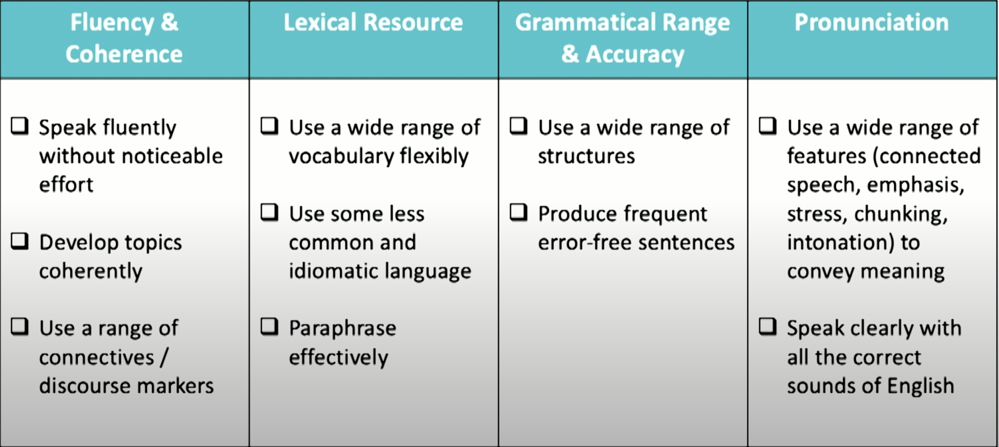

# IELTS Preparation Guideline [UKVI Academic]
---
## International English Language Testing System
1. **Speaking**: Contains 3 parts, each lasts between 11-14 mins.
2. **Listening**: 30 mins of audio recording with 40 questions. Then 10 mins will be given to transfer the answers to the actual script.
3. **Reading**: 3 passages with 40 questions. Lasts about an hour.
4. **Writing**: Two different tasks. Task 1 is a short report of graph, map, table etc. Duration is 1 hour in total.
# Resources
- [Free Crash Course](https://my.ieltsadvantage.com/)
## Blog post
- [ ] [Reddit Thread](https://www.reddit.com/r/IELTS/comments/bxrtc0/sharing_my_ielts_resources_l85_r90_w70_s80/)
## Practice Test
- [ ] [Cambridge Practice Books 9-13-Link will be updated]()

## Youtube
- [x] [Scoring Explanation](https://www.youtube.com/watch?v=-1PLA10xHhM&feature=youtu.be&fbclid=IwAR1hxa-gItEK7mSSPZ9Ml3OX6sfw9U3v2aGWcRMYrl9NejdxTEKkTe2o6nw)
  - Explains question patterns and marking distributions.
- [x] [Reading Hack](https://www.youtube.com/watch?v=ELGrKUR0EH4&fbclid=IwAR0Pg89M94lIWQiFhzkGrwWHOB6B-A7Qu-MawLvjvbtT1ovtsv-i-AS2gi0)
    - True/False/Not Given(answers usualy locate in a single sentence). `usualy given in the first passage`
  - Yes/No/Not given. `usualy given in the third passage`. Harder than T/F/Not given.
  - `If you a mark T/F as Y/N then it'll be incorrect.`
  - Answers of questions from same set will contain more or less all 3 options as the right answer. Answers are evenly distributed.
  - Answers come in the same order as the questions in the passage. Don't go backward to look for the answer.
  - Look for names and dates.
  - Look for paraphrasing (synonyoms)
- [ ] [IELTS LIZ](https://www.youtube.com/c/IELTSLiz789/videos?fbclid=IwAR21zIWWsS9zncF8SrXHyefTmaFtd7s5JfQv-r0-h6mCQBe3-uvzdMz2bJQ)
- [ ] [E2 IELTS](https://www.youtube.com/channel/UCglDIsg_Z9mE2oT9hsrbzFA)
- [ ] [Fasttrack IELTS](https://www.youtube.com/c/FastrackEducation/featured)
## Courses
- [ ] [E2 Language](https://app.e2language.com/Student/Home)
## Writing Test
- [ ] [Writing Task Guideline](https://drive.google.com/drive/folders/1fpi7LzfENUQBm9K7taXkkQmkG_Vu8SGB)
- [ ] [Writing Task 2](https://www.youtube.com/watch?v=pTGa9EEuZz0&list=PLdawRnR9ilZB8cHazEY1yaGptceBnY9Ht)
- [ ] [Writing Task 2-E2](https://www.youtube.com/watch?v=TvVc9oiFDQI&list=PLdawRnR9ilZAQ9nFJp6zTlDYFqBQFVGbd&fbclid=IwAR2TRcgOhcGOe3IF8TI0K2rdblWc0QJnSG4nPOs-MzIy3gmGKwZY9h86sNc)

## Speaking
- [X] [E2-speaking-pt1](https://www.youtube.com/watch?v=OyPvI_NxZU8&feature=youtu.be&fbclid=IwAR1_DXxW-WJ0Kx4tains8yn9Q56hWfIgkt-0UkbTgMAwKXcNGnWMIFvbcwA)
  - 1:1 with an examiner
  - 3 sections. Each section is about 11-14 minutes long.
  - 4 separate criteria for scoring.
    - fluency and coherence
    - lexical resources (vocabulary)
    - grammatical range and accuracy
    - pronunciation
	
  - Introduction: keep it short and factual.
- [x] [E2-Speaking-Part2](https://www.youtube.com/watch?v=Iyj8Fv5U3v4&feature=youtu.be&fbclid=IwAR3JriqYZUdpN53BIcRmoITK-hdpV0ziT7XkOdUSMTJTnS7Nn4Sv26N72R8)
  - Examiner will give a booklet and a pen & paper for taking notes on topic in one minute.
  - Need to give a talk on a topic for about 2-3 minutes. Don't worry about the examiner, you just keep going.
  - Use PPF (Past Present Future) strategy