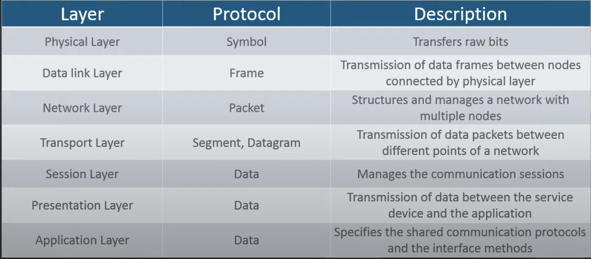
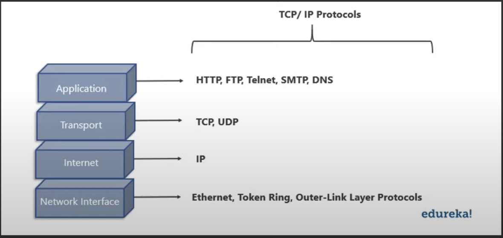

# Networking Interview Questions

## Wht is the meaning of Netowork

- Network is a connection between devices. These devices communicate with each other using physical or wireless connection.

## What is OSI Model?

- OSI stands for Open System Interconnection. Conceptual model that standardize the functions of telecommunication. It has 7 layers
- Hardware (Lower level)
  1. Physical Layer
  2. Data Link Layer
  3. Network Layer
- Heart of OSI Model

  4. Transport Layer

- Upper layer (Software Layer)

  5. Session Layer
  6. Presentation Layer
  7. Application Layer

### Give a brief description of the TCP/IP Model?

- TCP/IP model is the compressed version of the OSI model.
  
  - IP: Internet Protocol. Shares data using ipV4 or ipV6.

### Protocols

- Protocols are set of rules that govern communication
- Key elements of a protocol are
  - Syntax: Structure and format of data
  - Semantics: Refers to the meaning of each portion of bits
  - Timing: Refers to when data should be sent and received

#### HTTP

- Hyper Text Transfer Protocol
- HTTP allows communication over the internet. It defines how messages are to be transmitted and formatted over www.
- Uses Port No 80

#### TCP

- Transport Control Protocol.
- Connection Oriented Protocol that establishes and maintains connections between communicating devices until both of them are done exchaning.
- Reliable and error free communication.
- File Transfer, email

#### UDP

- User Datagram Protocol
- Used to create low latency and loss-tolerating communications.
- communicate via messages
- UDP allows packets to be dropped and receieved in different order.
- Multimedia, streaming

#### RIP

- Routing Information Protocol

#### DHCP

- Dynamice Host Configuration Protocol
- Network management protocol used on the UDP/IP networks

### Firewall

- Network monitoring system
- First line of defence between internal and external networks

### DoS

- Denial of Service
- Denies legitimate users from access
- Floods ther server with unnecessary requests

### DDoS

- DoS from multiple source

### MAC address

- Computers uniques 48 bit NIC

### DNS

- Domain Name System
- Translates domain names to ip address

### PING

- A computer program that is used to test the reachibility of a host.
